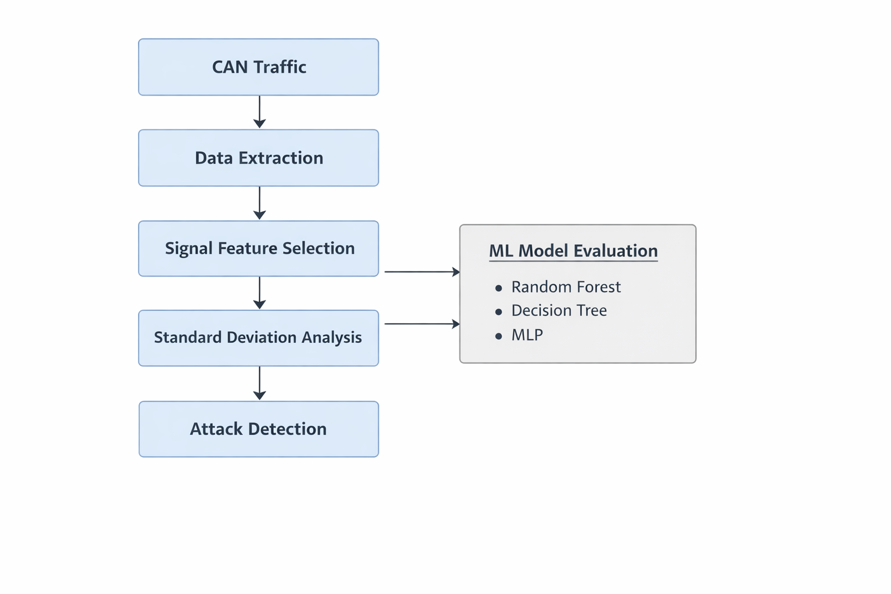
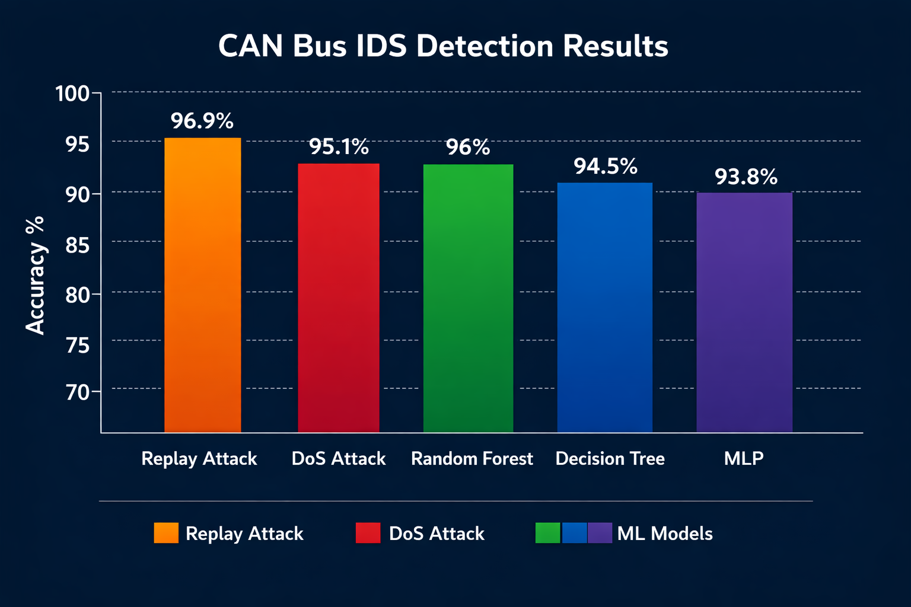

# CAN Bus Anomaly Detection IDS

Lightweight intrusion detection system (IDS) for automotive CAN bus networks, designed to identify malicious activity such as replay and denial-of-service (DoS) attacks in resource-constrained environments.

## Why this matters
The Controller Area Network (CAN bus) is widely used in modern vehicles but lacks built-in security features such as authentication and encryption. This makes it vulnerable to message injection, replay, and disruption attacks that can impact vehicle behaviour.

This project demonstrates how anomaly detection techniques can be applied to CAN traffic to identify abnormal signal patterns and potential attacks.

## What this project shows
- Simulation of CAN traffic using ICSim  
- Implementation of replay and DoS attack scenarios  
- Lightweight anomaly detection using signal behaviour (standard deviation)  
- Comparison with machine learning models (Random Forest, Decision Tree, MLP)  
- High detection performance while remaining suitable for constrained systems  
---

## 🚗 Problem

Modern vehicles rely on CAN bus communication, which lacks authentication and encryption, making it vulnerable to attacks such as:

- Replay attacks
- Denial of Service (DoS)

Many existing solutions rely on complex transformations or heavy machine learning models, which are not suitable for resource-constrained ECUs.

---

## 💡 Solution

This project proposes a lightweight anomaly detection approach based on:

- Extracting key signal values from CAN data fields
- Measuring behavioural changes using standard deviation
- Detecting anomalies without requiring labelled datasets

The goal is to provide a **simple, efficient, and practical IDS** for automotive environments.

---
## 🧱 System Architecture

## ⚙️ Implementation

- CAN traffic simulated using ICSim
- Replay and DoS attacks implemented
- Data extracted and processed from CAN frames
- IDS implemented in C
- Machine learning models evaluated in Python:
  - Random Forest
  - Decision Tree
  - MLP

---

## 📊 Results

- Replay Attack Detection: ~96.9%
- DoS Attack Detection: ~95.1%
- Random Forest Accuracy: ~96%

Key observation:
Replay attacks remain more difficult to detect compared to DoS attacks.

---

## 🧠 Key Insight

Lightweight signal-based anomaly detection can achieve competitive performance without relying on complex or computationally expensive models.

This highlights an important trade-off between detection accuracy and real-world deployability in automotive systems.

---

## Documentation
- [Project Summary](docs/summary.md)

